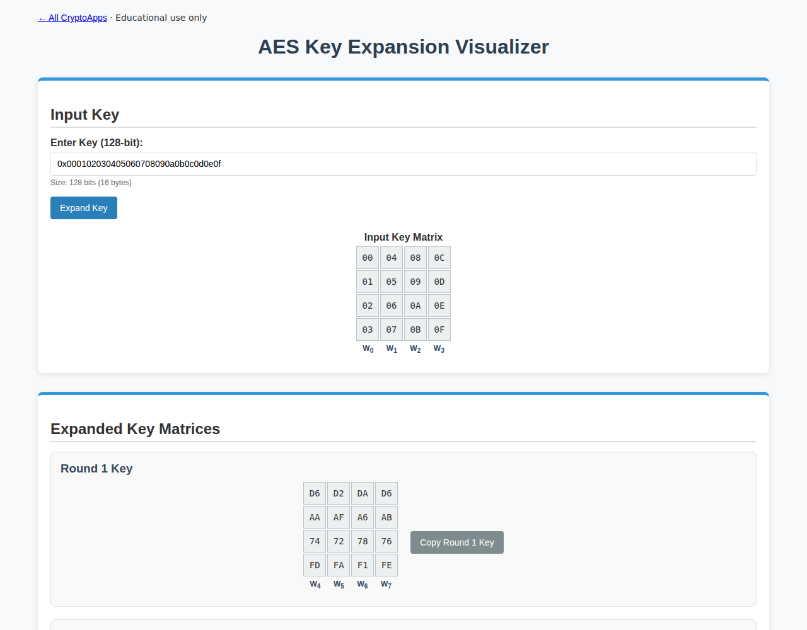

# AES Key Expansion

Visualize the ten derived AES-128 round keys.

[Back to collection](../README.md) · [App source](index.html)

**Run:** start the server from the [main README](../README.md), then open `http://localhost:8000/aes-key/`.

**Try it:** Expand `0x000102030405060708090a0b0c0d0e0f`. The first round key is `d6aa74fdd2af72fadaa678f1d6ab76fe`.

Use exactly 16 bytes for standard AES-128.

