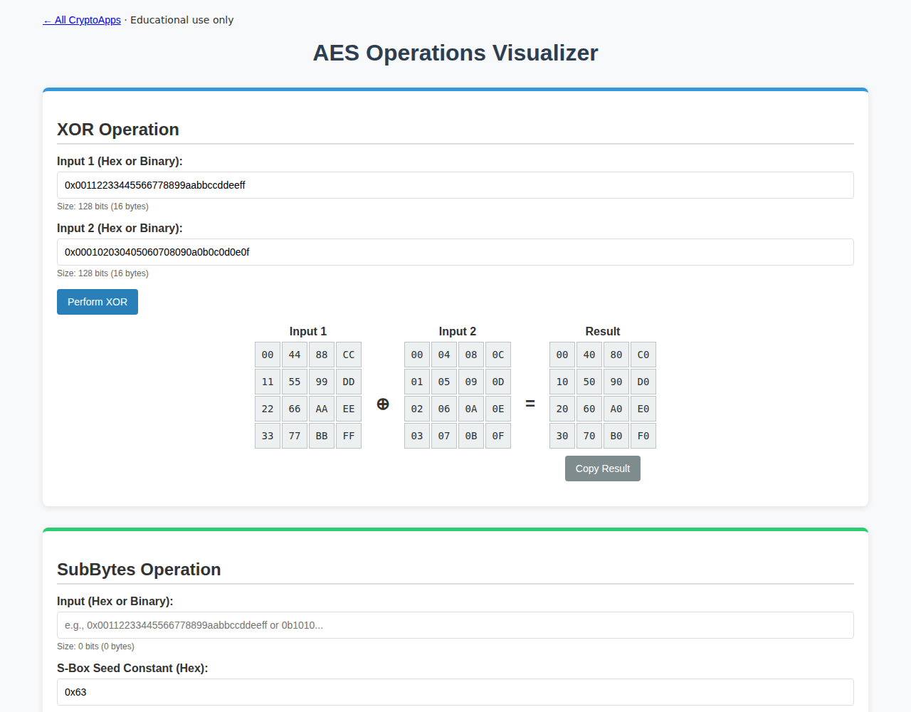

# AES Operations

Explore SubBytes, ShiftRows, MixColumns, XOR, and inverses.

[Back to collection](../README.md) · [App source](index.html)

**Run:** start the server from the [main README](../README.md), then open `http://localhost:8000/aes-operations/`.

**Try it:** Keep the S-box constant at `0x63` for standard AES. In MixColumns, enter `0xdb135345000000000000000000000000`; the first column becomes `8e 4d a1 bc`.

These are individual transformations, not complete encryption.

