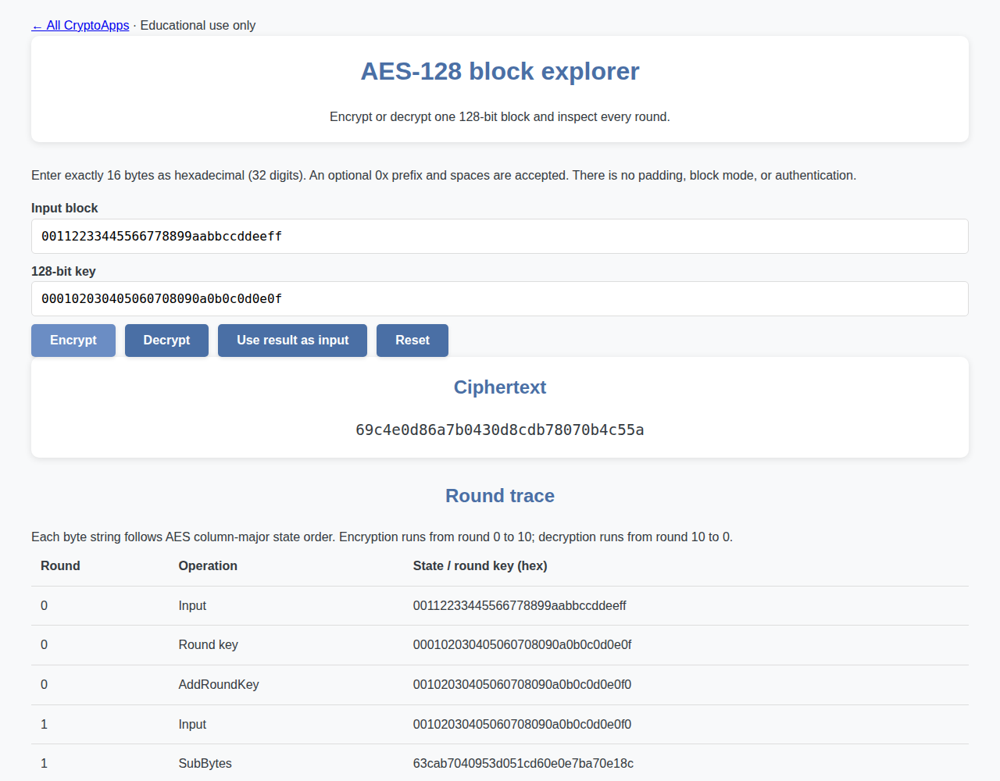

# AES-128

Encrypt/decrypt a 16-byte block and inspect every round.

[Back to collection](../README.md) · [App source](index.html)

**Run:** start the server from the [main README](../README.md), then open `http://localhost:8000/aes/`.

**Try it:** Enter block `00112233445566778899aabbccddeeff` and key `000102030405060708090a0b0c0d0e0f`. Encrypt → `69c4e0d86a7b0430d8cdb78070b4c55a`. Use **Use result as input**, then **Decrypt**, to reverse it.

Use exactly 32 hexadecimal digits per input. This is a single-block demonstration without padding or authentication.

