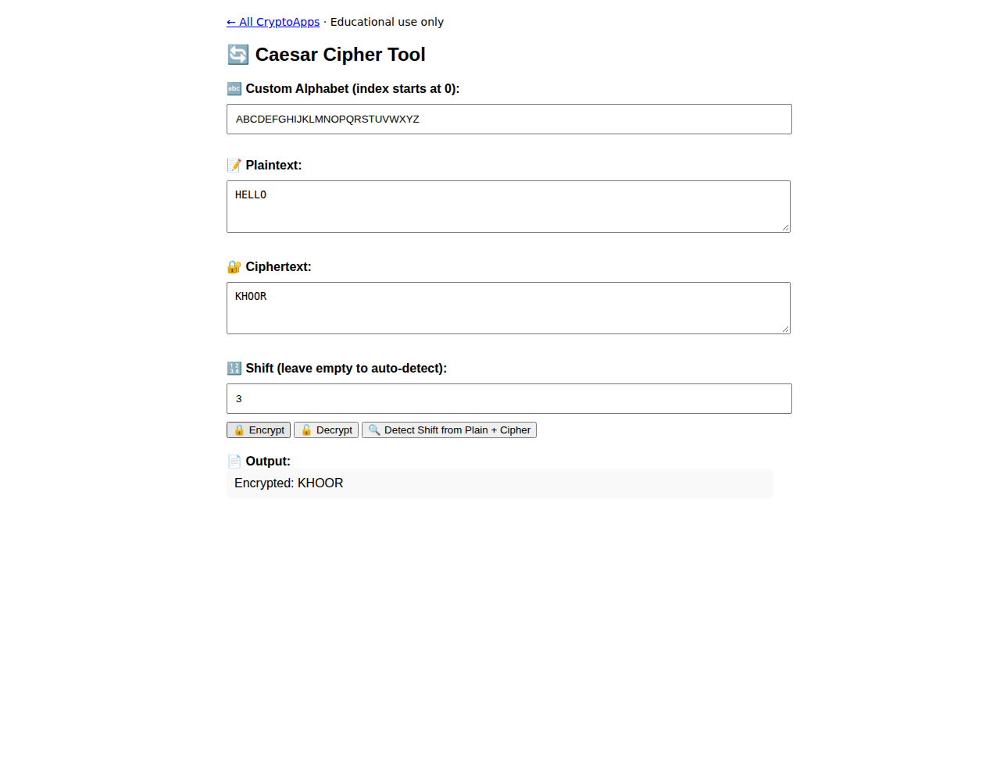

# Caesar Cipher

Encrypt, decrypt, and recover shifts using a custom alphabet.

[Back to collection](../README.md) · [App source](index.html)

**Run:** start the server from the [main README](../README.md), then open `http://localhost:8000/caesar/`.

**Try it:** Use alphabet `ABCDEFGHIJKLMNOPQRSTUVWXYZ`, plaintext `HELLO`, and shift `3`. Result: `KHOOR`. Negative and larger shifts also wrap correctly.

Case matters. Inputs are saved locally.

