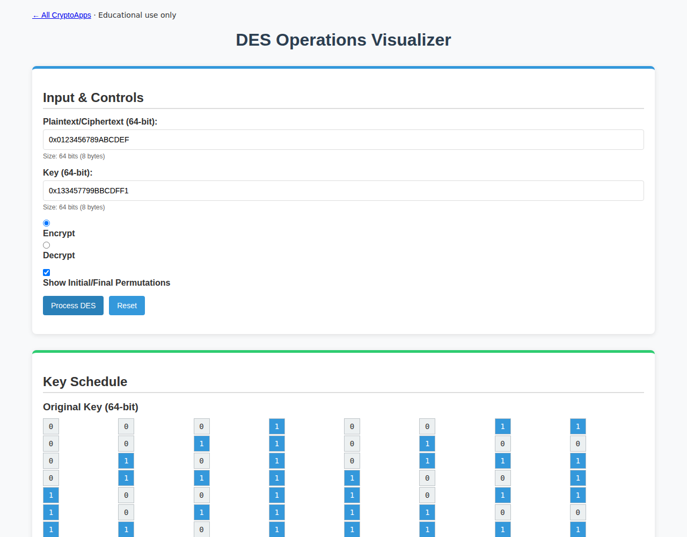

# DES Operations

Explore DES permutations, subkeys, S-boxes, and rounds.

[Back to collection](../README.md) · [App source](index.html)

**Run:** start the server from the [main README](../README.md), then open `http://localhost:8000/des-operations/`.

**Try it:** Process plaintext `0x0123456789ABCDEF` with key `0x133457799BBCDFF1`. Result: `0x85E813540F0AB405`. Select a round to inspect it.

Use valid 64-bit inputs. DES is for historical study only.

