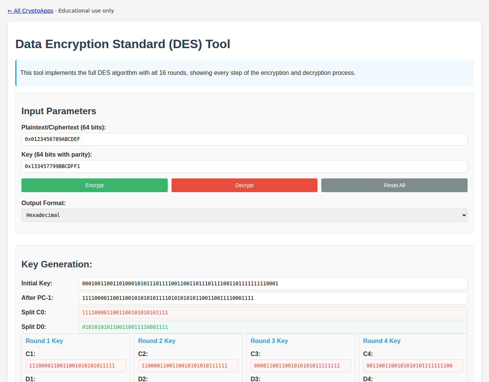

# DES

Encrypt/decrypt a single DES block with round details.

[Back to collection](../README.md) · [App source](index.html)

**Run:** start the server from the [main README](../README.md), then open `http://localhost:8000/des/`.

**Try it:** Encrypt `0x0123456789ABCDEF` with key `0x133457799BBCDFF1`. Hex output: `85E813540F0AB405`. Use explicit `0x` prefixes for hex input.

Use valid 64-bit inputs. Short inputs are padded; oversized inputs are truncated. DES is for historical study only.

