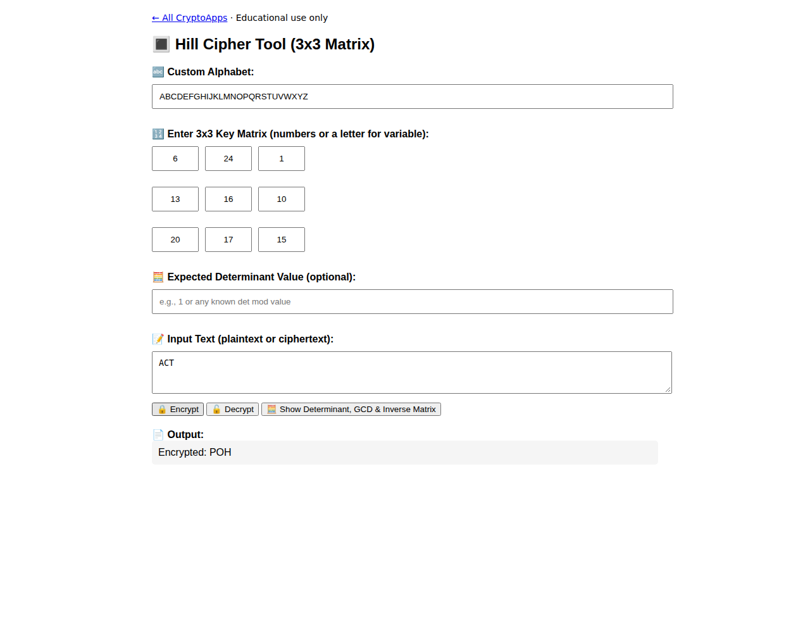

# Hill Cipher

Encrypt/decrypt with a 3×3 matrix and inspect its inverse.

[Back to collection](../README.md) · [App source](index.html)

**Run:** start the server from the [main README](../README.md), then open `http://localhost:8000/hill/`.

**Try it:** Enter matrix rows `6 24 1`, `13 16 10`, `20 17 15`. With the default alphabet, `ACT` encrypts to `POH`. Put ciphertext in the same input field to decrypt.

Input is uppercased, spaces are removed, and length must be divisible by three. Decryption requires an invertible matrix.

