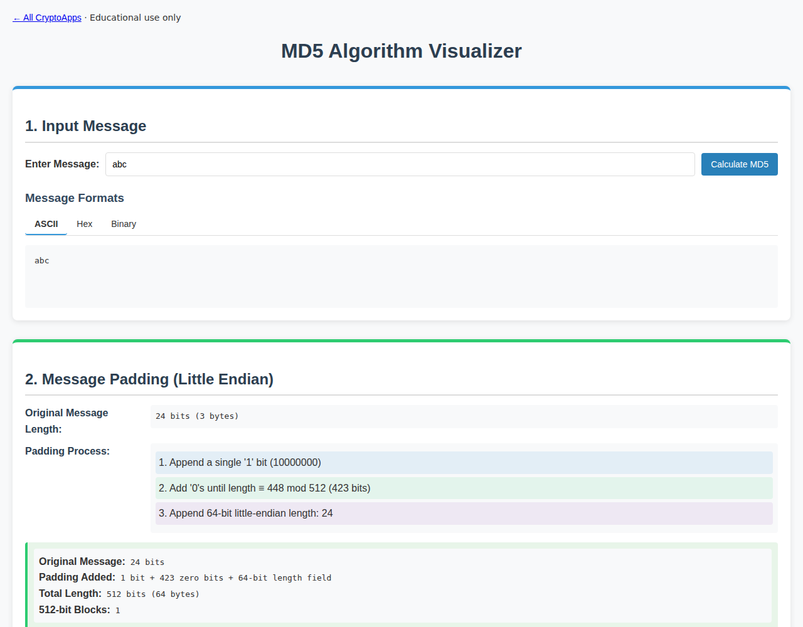

# MD5

Inspect message padding, compression steps, and MD5 digests.

[Back to collection](../README.md) · [App source](index.html)

**Run:** start the server from the [main README](../README.md), then open `http://localhost:8000/md5/`.

**Try it:** Enter `abc` and calculate. Digest: `900150983cd24fb0d6963f7d28e17f72`. Text is encoded as UTF-8.

Use small messages. MD5 is not suitable for collision-resistant security.

