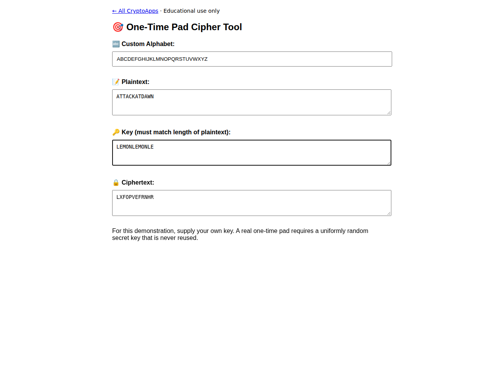

# One-Time Pad

Explore modular addition with an equal-length key.

[Back to collection](../README.md) · [App source](index.html)

**Run:** start the server from the [main README](../README.md), then open `http://localhost:8000/one-time-pad/`.

**Try it:** With the default alphabet, plaintext `ATTACKATDAWN` and key `LEMONLEMONLE` produce `LXFOPVEFRNHR`. This repeated key is only an arithmetic example, not a secure pad.

A real pad needs a uniformly random secret key of equal length, never reused. This app does not manage secure keys.

