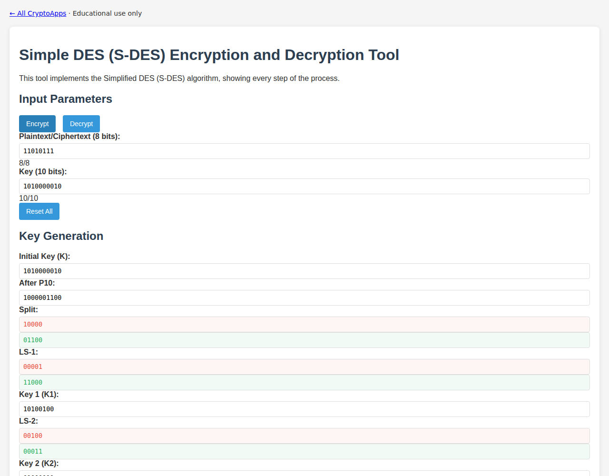

# Simplified DES

Study the two-round teaching cipher.

[Back to collection](../README.md) · [App source](index.html)

**Run:** start the server from the [main README](../README.md), then open `http://localhost:8000/s-des/`.

**Try it:** Encrypt binary plaintext `11010111` with binary key `1010000010`. Result: `10101000`. This uses an 8-bit block and 10-bit key, unlike DES.

Reset before a fresh run if you edited intermediate values. The app can save state locally.

