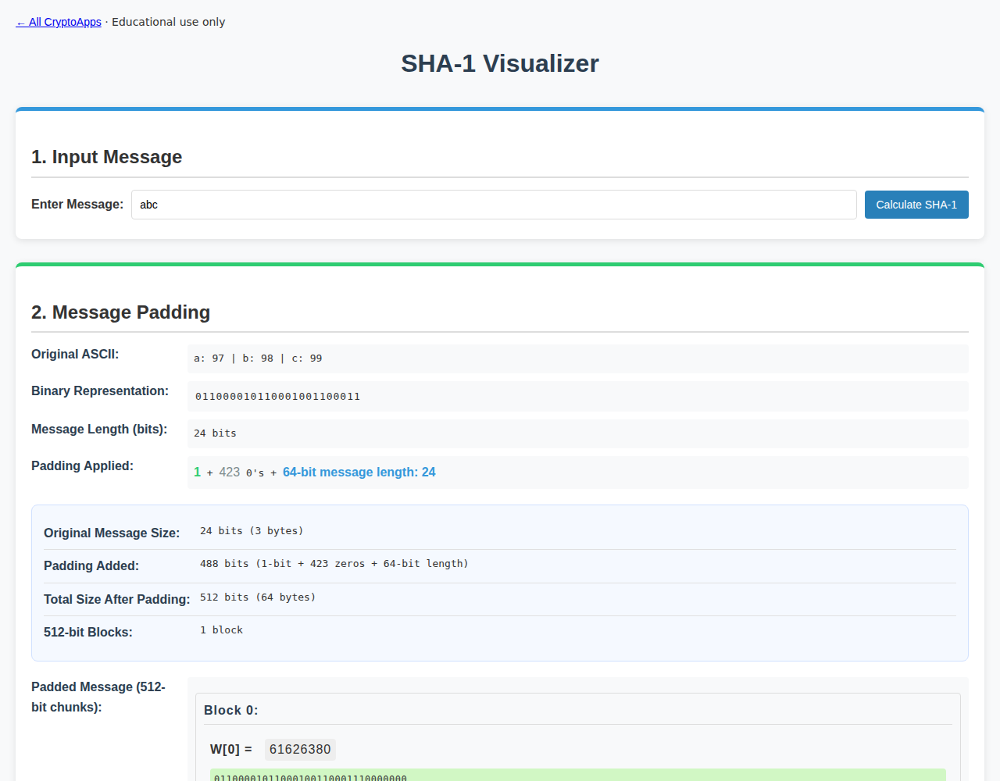

# SHA-1

Explore the message schedule, compression steps, and SHA-1 digests.

[Back to collection](../README.md) · [App source](index.html)

**Run:** start the server from the [main README](../README.md), then open `http://localhost:8000/sha1/`.

**Try it:** Enter `abc` and calculate. Digest: `a9993e364706816aba3e25717850c26c9cd0d89d`. Text is encoded as UTF-8.

Use small messages. SHA-1 is not suitable for collision-resistant security.

