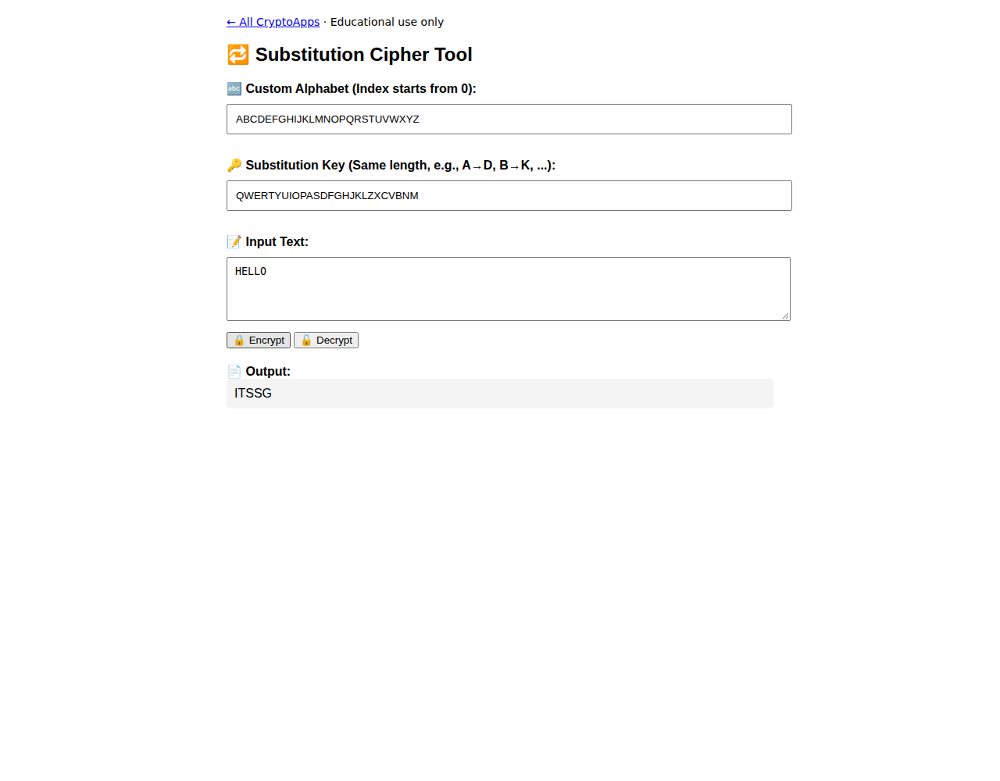

# Substitution Cipher

Encrypt/decrypt with a custom alphabet permutation.

[Back to collection](../README.md) · [App source](index.html)

**Run:** start the server from the [main README](../README.md), then open `http://localhost:8000/substitution/`.

**Try it:** Use alphabet `ABCDEFGHIJKLMNOPQRSTUVWXYZ`, key `QWERTYUIOPASDFGHJKLZXCVBNM`, and input `HELLO`. Encrypt → `ITSSG`. The key must contain each alphabet character exactly once.

Case matters. Inputs are saved locally.

