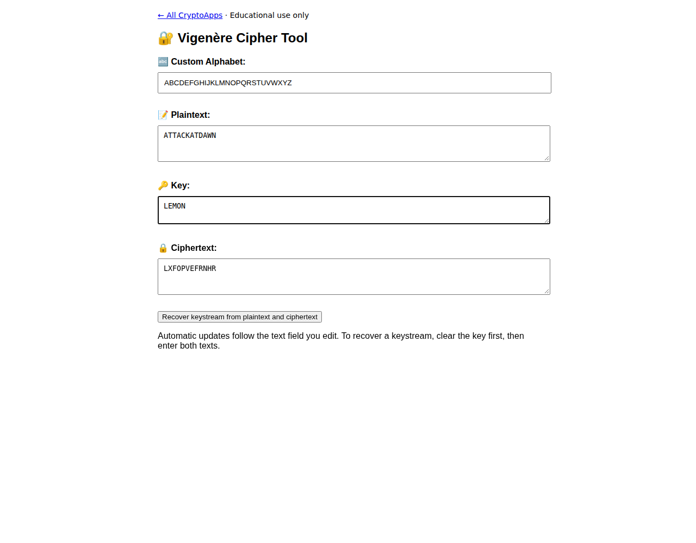

# Vigenère Cipher

Use a repeating key or recover a known-text keystream.

[Back to collection](../README.md) · [App source](index.html)

**Run:** start the server from the [main README](../README.md), then open `http://localhost:8000/vigenere/`.

**Try it:** With the default alphabet, plaintext `ATTACKATDAWN` and key `LEMON` produce `LXFOPVEFRNHR`. Editing ciphertext switches to decryption. Clear the key before recovering a keystream from both texts.

All message/key characters must be in the alphabet. Use uppercase letters with the default alphabet.

